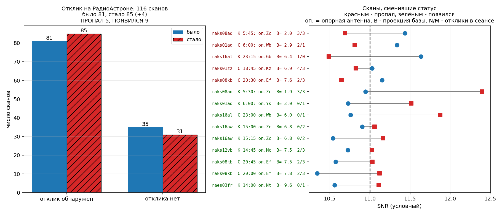
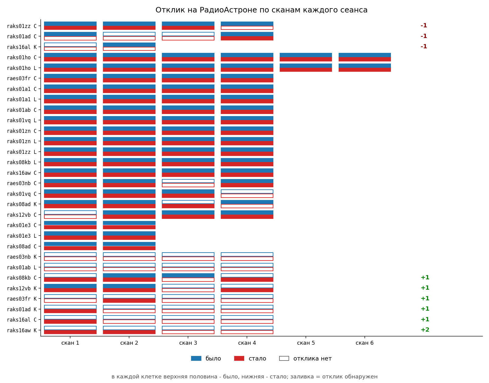
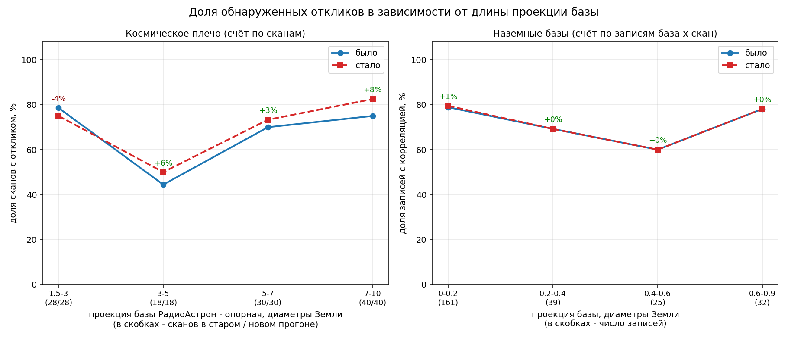
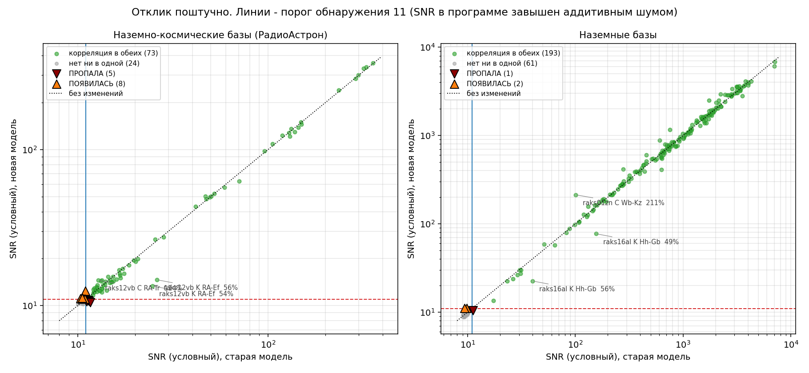
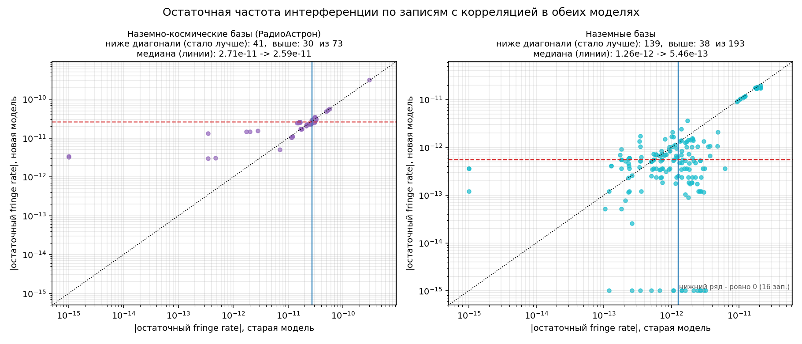
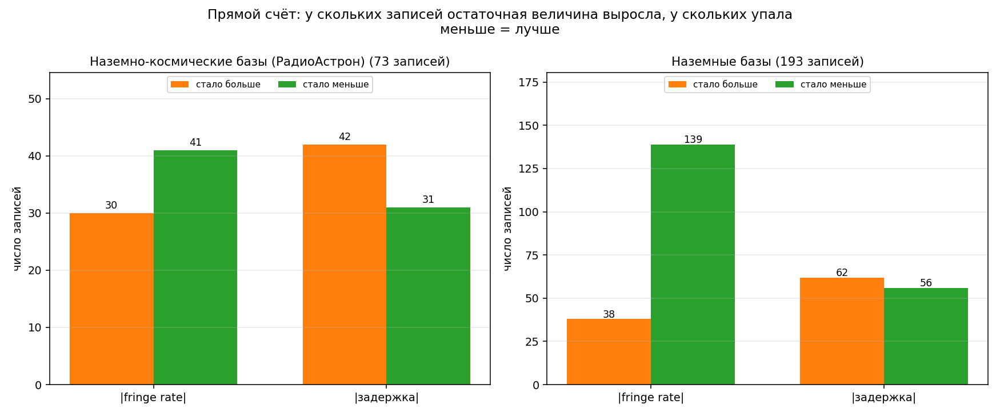
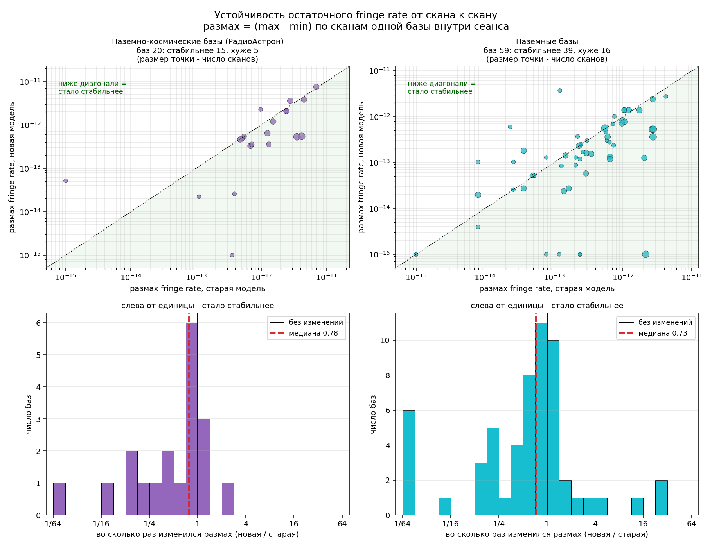
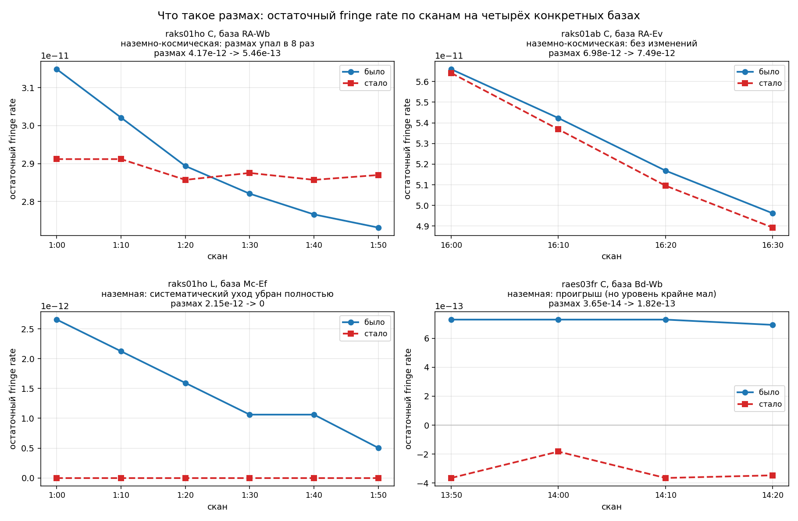

# Сравнение старой и новой модели геометрической задержки по результатам корреляционной обработки

## 1. Данные, термины и метод счёта

**Данные.** 30 сеансов из `Correlator_Tests/new/`, эксперименты `raes*` и `raks*`. Для каждого сеанса
есть пара выходных файлов поиска корреляционного отклика: `*_ffr.txt` — старая модель задержки,
`*_p_ffr.txt` — новая.

**Термины, принятые в этом документе:**

* **Сеанс** — эксперимент в конкретном диапазоне, например `raks16al K`. Каждый эксперимент
  обрабатывался в двух диапазонах независимо, поэтому C и K одного эксперимента считаются
  двумя разными сеансами.
* **Скан** — один временной интервал поиска отклика внутри сеанса.
* **Запись** — одна база (пара антенн) на одном скане в одной поляризации. Это элементарная
  единица сравнения.
* **Космическое плечо** — всё, что относится к наблюдениям РадиоАстрона (`RA`).
  **Наземно-космическая база** — РадиоАстрон относительно опорной антенны конкретного блока.
  **Наземная база** — база из двух наземных антенн.

**Критерий наличия корреляции.** Запись считается имеющей корреляцию, если строка `CLOCK = ...`
в выходном файле **не** закомментирована символом `#`. Никаких порогов и никаких медиан при
определении факта корреляции не применяется — берётся ровно то, что записал коррелятор.

### 1.1 Опорная антенна и выбор единицы счёта

Опорная антенна назначается **своя в каждом блоке** и от блока к блоку меняется. Запись
`CLOCK = X` в блоке — это результат поиска отклика на антенне X относительно опорной антенны
**этого** блока. Отсюда два следствия, которые определяют всю методику счёта.

Во-первых, пара (опорная, антенна) не является базой, прослеживаемой через весь сеанс: она
возникает и исчезает вместе с назначением опорной. Утверждения вида «эта база потеряла
корреляцию целиком» на таком материале некорректны — «база» может существовать всего в одном
скане, и тогда любое единичное изменение выглядит как изменение базы целиком.

Во-вторых, в 6 блоках из 118 опорная антенна в старом и новом прогоне **разная**:

| сеанс | скан | опорная было → стало |
|---|---|---|
| raks01zn C | 13:15, 13:30, 13:45 | Ys → Kz |
| raks12vb C | 14:00 | Ir → Hh |
| raks12vb K | 14:30 | Nt → Mc |
| raks16al C | 23:00 | Ir → Wb |

В таких блоках сравнивать «ту же базу» невозможно: базы разные. При сравнении по базам эти
блоки выпадают — 25 записей, из них 6 по РадиоАстрону и 19 по наземным антеннам.

Поэтому в отчёте используются **две единицы счёта**, каждая там, где она корректна:

* **Скан** — для вопроса о наличии отклика на РадиоАстроне (разделы 3, 4, 6). Вопрос ставится
  так: «обнаружен ли в этом скане отклик на РадиоАстроне», без привязки к тому, какая антенна
  оказалась опорной. Ответ от выбора опорной не зависит, поэтому учитываются все 116 сканов,
  включая 6 со сменой опорной.
* **Запись = база × скан** — для сравнения величин отклика (разделы 7 и 8), где сравниваются
  два измерения одной и той же величины. Здесь блоки со сменой опорной исключены: остаточная
  задержка и остаточная частота относятся к часам разных станций и несопоставимы.

**Объём.** По РадиоАстрону: 118 сканов, после исключения блока с багом (раздел 2) —
**116 сканов**. По записям «база × скан»: 377, после исключения того же блока — **367 записей**.

> **Про SNR.** Число в поле `snr=` — не физическое отношение сигнал/шум: в программе поиска отклика
> оно считается с аддитивной шумовой добавкой порядка 10, поэтому «SNR = 10.5» означает не
> «отклик вдвое слабее порога», а «отклика нет». Порог принятия решения — 11. Все значения SNR
> ниже даны как **условные** и используются только для того, чтобы показать, насколько близко
> к порогу находится тот или иной случай. Выводы строятся на факте наличия/отсутствия
> корреляции, а не на величине SNR.

---

## 2. Что исключено из статистики и почему

`raks08ad C`, опорная антенна Ef — 10 записей. Это последствия ошибки именования файлов полиномов:
старая схема писала `ИМЯСТАНЦИИ.txt` без диапазона, поэтому при расчёте двух диапазонов одного
эксперимента в общий каталог полиномы K затирали полиномы C. У станций Ef и Tr состав сканов
в C и K различался, полиномы C оказались обрезаны по времени — ровно 10 записей остались без
покрытия, корреляция там развалилась (SNR 2000–3000 → 9).

Ошибка исправлена в самой программе: полиномы задержки и uvw теперь **всегда** пишутся как
`ИМЯСТАНЦИИ_ДИАПАЗОН.txt`, диапазон берётся из CFX (`P`, `L`, `C`, `K` и старше). Полиномы
пересчитаны заново для всех 30 CFX без единого сбоя. Исходные файлы коррелятора не менялись,
поэтому блок с багом просто исключён из статистики.

---

## 3. Космическое плечо и наземные базы

Группы разнесены, потому что физика у них разная: на наземных базах модель задержки меняется
на единицы пикосекунд, на базах с РадиоАстроном — на десятки наносекунд (релятивистский ход
бортовых часов, орбитальная геометрия, TIMEOFS). Далее, когда говорится «отклик пропал /
появился», имеется в виду **космическое плечо**, то есть отклик на РадиоАстроне.

**Космическое плечо, счёт по сканам** (единственный корректный счёт, см. 1.1):

| | значение |
|---|---|
| сеансов с наблюдениями РадиоАстрона | 30 |
| сканов | 116 |
| **отклик обнаружен: было → стало** | **81 → 85 (+4)** |
| отклик есть в обеих моделях | 76 |
| **отклик ПРОПАЛ (сканов)** | **5** |
| **отклик ПОЯВИЛСЯ (сканов)** | **9** |
| отклика нет ни в одной модели | 26 |
| проекция базы РадиоАстрон – опорная | 1.6 – 9.8 диаметров Земли |

**Наземные базы, счёт по записям «база × скан»:**

| | значение |
|---|---|
| записей | 257 |
| различных баз | 89 |
| **корреляция: было → стало** | 194 → 195 (+1) |
| корреляция в обеих моделях | 193 |
| корреляция пропала / появилась (записей) | 1 / 2 |
| проекция базы | 0.02 – 0.86 диаметров Земли |

**Итог по космическому плечу: чистый прирост +4 скана с обнаруженным откликом (81 → 85 из 116).**

---

## 4. Сканы, сменившие статус на РадиоАстроне

### 4.1 Отклик ПРОПАЛ — 5 сканов

| сеанс | скан | опорная | проекция, D⊕ | SNR было → стало | отклики в сеансе |
|---|---|---|---|---|---|
| raks08ad K | 5:45 | Zc | 2.0 | 11.43 → 10.69 | 3 → 3 из 4 |
| raks01ad C | 6:00 | Wb | 2.9 | 11.34 → 10.81 | 2 → 1 из 4 |
| **raks16al K** | **23:15** | **Gb** | **6.4** | **11.64 → 10.49** | **1 → 0 из 2** |
| raks01zz C | 18:45 | Kz | 6.9 | 11.03 → 10.82 | 4 → 3 из 4 |
| raks08kb C | 20:30 | Ef | 7.6 | 11.15 → 10.64 | 2 → 3 из 4 |

Из пяти потерь только одна — `raks16al K` — оставила сеанс без отклика на РадиоАстроне вовсе.
В `raks08ad K` число откликов не изменилось (3 → 3): отклик пропал в одном скане и появился
в другом. В `raks08kb C` сеанс в целом выиграл (2 → 3).

### 4.2 Отклик ПОЯВИЛСЯ — 9 сканов

| сеанс | скан | опорная | проекция, D⊕ | SNR было → стало | отклики в сеансе |
|---|---|---|---|---|---|
| raks08ad K | 5:30 | Zc | 1.9 | 10.94 → 12.40 | 3 → 3 из 4 |
| **raks01ad K** | **6:00** | **Ys** | **3.0** | **10.73 → 11.52** | **0 → 1 из 4** |
| **raks16al C** | **23:00** | **Ir → Wb** | **5.9 → 6.0** | **10.76 → 11.88** | **0 → 1 из 4** |
| **raks16aw K** | **15:00** | **Zc** | **6.8** | **10.90 → 11.06** | **0 → 2 из 4** |
| **raks16aw K** | **15:15** | **Zc** | **6.8** | **10.54 → 11.16** | **0 → 2 из 4** |
| raks12vb K | 14:45 | Mc | 7.5 | 10.73 → 11.02 | 2 → 3 из 4 |
| raks08kb C | 20:45 | Ef | 7.5 | 10.57 → 11.03 | 2 → 3 из 4 |
| raks08kb C | 20:00 | Ef | 7.8 | 10.34 → 11.12 | 2 → 3 из 4 |
| **raes03fr K** | **14:00** | **Nt** | **9.6** | **10.56 → 11.11** | **0 → 1 из 4** |

Строка `raks16al C` — тот самый случай со сменой опорной антенны (Ir → Wb). При сравнении
по базам он выпадал полностью; при счёте по сканам он учитывается, и это самый сильный
из появившихся откликов: 10.76 → 11.88.

### 4.3 Счёт по сеансам

Из 30 сеансов с наблюдениями РадиоАстрона:

* **потерял отклик полностью — 1**: `raks16al K` (1 → 0);
* **приобрели отклик полностью — 4**: `raes03fr K` (0 → 1), `raks01ad K` (0 → 1),
  `raks16al C` (0 → 1), `raks16aw K` (0 → 2);
* уменьшили число откликов, но не до нуля — 2: `raks01zz C` (4 → 3), `raks01ad C` (2 → 1);
* увеличили, не с нуля — 2: `raks08kb C` (2 → 3), `raks12vb K` (2 → 3);
* без изменений — 21, в том числе 2 сеанса, где отклика нет ни в старой, ни в новой модели:
  `raes03nb K`, `raks01ab L`.

**По сеансам счёт 1 : 4 в пользу новой модели.** Обратите внимание, что оба изменения
пришлись на один эксперимент `raks16al`: в диапазоне K отклик потерян, в диапазоне C —
приобретён.

### 4.4 Разбор одного случая: raks12vb K

Этот сеанс показателен, потому что демонстрирует, почему счёт ведётся по сканам, а не по базам.

| скан | опорная (было / стало) | SNR было | SNR стало | отклик |
|---|---|---|---|---|
| 14:00 | Ef / Ef | 26.02 | 14.65 | есть / есть |
| 14:15 | Ef / Ef | 24.65 | 13.36 | есть / есть |
| 14:30 | **Nt / Mc** | 10.84 | 10.58 | нет / нет |
| 14:45 | Mc / Mc | 10.73 | 11.02 | **нет / есть** |

Отклик на РадиоАстроне в этом сеансе получен относительно Эффельсберга и присутствует в обеих
моделях; в скане 14:30 опорная антенна вообще разная в двух прогонах. Итог по сеансу: **2 → 3
из 4 сканов.** Формулировка «база RA–Mc приобрела корреляцию целиком», которая получалась при
счёте по базам, здесь неверна: пара RA–Mc существует всего в одном-двух сканах и появляется
только потому, что коррелятор назначил Mc опорной, когда Эффельсберг перестал наблюдать.

---

## 5. Наземные базы: три смены статуса, все шумовые

На наземных базах формальный счёт составил 194 → 195 записей с корреляцией. Изменились три записи:

| сеанс | база | скан | проекция, D⊕ | SNR было → стало | |
|---|---|---|---|---|---|
| raes03fr K | Ev–Nt | 14:10 | 0.13 | 9.80 → 11.06 | появилась |
| raks01ad K | Tr–Ys | 6:10 | 0.14 | 9.35 → 11.08 | появилась |
| raks12vb C | Ys–Tr | 14:15 | 0.14 | 11.23 → 10.47 | пропала |

**Это не физические изменения, а шум.** На наземных базах достоверная корреляция — это SNR
порядка сотен и выше; если на короткой наземной базе отклик едва дотягивает до 11, это повод
проверять, не перепутаны ли полосы, а не считать это обнаружением. В нашем массиве так и есть:
из 195 наземных обнаружений в новой модели **179 (92 %) имеют SNR выше 100**, и только три
записи лежат ниже 20 — ровно те две, что «появились», плюс `raks16al K Tr–Gb` (17.30 → 13.44).
В старой модели ниже 20 было две записи.

Иначе говоря: **в новой модели на наземных базах присутствуют 3 шумовых отклика, из них 2
появились впервые, и один шумовой отклик (raks12vb C Ys–Tr) пропал.** Формальный прирост +1
на наземных базах целиком укладывается в эту шумовую тройку и содержательного значения не имеет.

Существенно другое: оба наземных «появления» — в тех же сеансах `raes03fr K` и `raks01ad K`,
которые приобрели и отклик на РадиоАстроне. Это два сеанса, ранее не дававшие отклика
вообще; новая модель подняла их целиком.

---

## 6. Зависимость от длины проекции базы

Проекция базы вычислена из наших же полиномов uvw: B = |(u,v) станции − (u,v) опорной антенны| · c,
выражена в диаметрах Земли (12 742 км, обозначение D⊕).

Для космического плеча берётся проекция базы РадиоАстрон – опорная антенна того блока, в котором
получен отклик.

| космическое плечо, D⊕ | сканов | было | стало | |
|---|---|---|---|---|
| 1.5 – 3 | 28 | 78.6 % | 75.0 % | −4 % |
| 3 – 5 | 18 | 44.4 % | 50.0 % | **+6 %** |
| 5 – 7 | 30 | 70.0 % | 73.3 % | +3 % |
| 7 – 10 | 40 | 75.0 % | 82.5 % | **+8 %** |

| наземные базы, D⊕ | записей | было | стало | |
|---|---|---|---|---|
| 0 – 0.2 | 161 | 78.9 % | 79.5 % | +1 % |
| 0.2 – 0.4 | 39 | 69.2 % | 69.2 % | 0 |
| 0.4 – 0.6 | 25 | 60.0 % | 60.0 % | 0 |
| 0.6 – 0.9 | 32 | 78.1 % | 78.1 % | 0 |

**Вывод.** На наземных базах доля обнаружений практически не меняется — как и должно быть, там
разница моделей ничтожна (а единственный сдвиг +1 % в первой группе — та самая шумовая тройка
из раздела 5). Весь эффект сосредоточен на космическом плече, и он **растёт с длиной проекции**:
начиная с 3 D⊕ прибавка положительна во всех группах, на самых длинных проекциях, 7–10 диаметров
Земли, она максимальна и составляет +8 %. Это ровно тот режим, где вклад релятивистского хода
бортовых часов и орбитальной геометрии в задержку наибольший. Единственное проседание — группа
1.5–3 D⊕ (−4 %); это два случая из раздела 4.1, `raks08ad K` и `raks01ad C`, причём в первом из
них сеанс в целом не потерял ничего.

---

## 7. Величины отклика на записях, где корреляция есть в обеих моделях

Здесь и в разделе 8 единица — запись «база × скан»: сравниваются два измерения одной и той же
величины на одной и той же базе. Блоки со сменой опорной антенны (см. 1.1) исключены — остаточная
задержка и остаточная частота в них относятся к часам разных станций. Для космического плеча
«база» означает РадиоАстрон относительно опорной антенны данного блока.

### 7.1 Где расположены смены статуса

Все смены статуса лежат вплотную к порогу — в диапазоне условного SNR от 10.3 до 11.9. Никакого
разрушения сильных откликов нет: смена статуса — это всегда пограничная ситуация. Сама величина
SNR у порога определяется шумом, а не моделью задержки, поэтому она не годится как мера качества
и в дальнейшем счёте не используется (медиана отношения SNR новая/старая равна 0.992 для
наземно-космических баз и 0.998 для наземных — то есть отличие от единицы пренебрежимо мало;
при этом разброс у наземно-космических баз даже уже, чем у наземных).

### 7.2 Остаточная частота интерференции (fringe rate)

| | записей | стало лучше | стало хуже | медиана \|rate\| было → стало |
|---|---|---|---|---|
| наземно-космические | 73 | 41 | 30 | 2.71e−11 → 2.59e−11 |
| **наземные** | **193** | **139** | **38** | **1.26e−12 → 5.46e−13** |

**Это самый чистый и однозначный результат всего анализа.** На наземных базах остаточный
fringe rate падает по медиане более чем вдвое, у 139 записей из 193 он уменьшился, а у 16 записей
стал ровно нулём (в старой модели таких было 3). Это прямое свидетельство того, что новая модель
точнее описывает производную задержки по времени.

На наземно-космических базах остаточный fringe rate почти не меняется и остаётся на **два порядка**
больше наземного (2.6e−11 против 5.5e−13). Моделью задержки этот уровень не определяется и ею
не снимается. Это накопленная ошибка радиоинтерферометрического тракта космического плеча,
в которую входят:

* погрешность определения орбиты аппарата;
* нестабильность бортового стандарта частоты;
* аппаратные задержки в трактах самого аппарата;
* аппаратные задержки в тракте станции приёма;
* шумы электроники и трассы радиолинии передачи данных на Землю.

Разделить эти вклады по выходным данным коррелятора невозможно — они входят в остаток совместно
и в общем случае неразличимы. Это самостоятельная задача, к настоящему отчёту не относящаяся.

Практический вывод: **уровень 1e−11 на наземно-космических базах следует считать пределом,
достижимым средствами модели задержки.** Дальнейшее уменьшение возможно только внешними
средствами — калибровкой инструментальных задержек на борту и на станции приёма, использованием
сигнала фазовой калибровки, уточнением орбиты по независимым измерениям, — то есть за счёт
измерительного тракта, а не расчёта.

### 7.3 Прямой счёт остаточных величин

| | \|fringe rate\| больше / меньше | \|задержка\| больше / меньше |
|---|---|---|
| наземно-космические (73 записи) | 30 / 41 | 42 / 31 |
| наземные (193 записи) | **38 / 139** | 62 / 56 |

По остаточной задержке распределение близко к симметричному в обеих группах — ожидаемо, она
определяется главным образом ходом станционных часов, а не моделью. Единственная явная
асимметрия — по остаточному fringe rate на наземных базах, и она в пользу новой модели.

---

## 8. Устойчивость fringe rate от скана к скану

### 8.1 Что измеряется и зачем

Раздел 7.2 отвечает на вопрос «насколько велик остаток», а этот — на вопрос «насколько он
постоянен». Это разные вещи, и для наземно-космических баз вторая гораздо показательнее.

Логика простая. На одной базе внутри одного сеанса остаточный fringe rate должен быть **почти
постоянным**: он задаётся уходом станционных часов, который за десятки минут меняется медленно.
Всё, что «гуляет» сверх этого от скана к скану, — это ошибка модели, меняющаяся во времени.

Размах чувствителен только к тому, что меняется от скана к скану. Всё, что за сеанс меняется
медленно, из него выпадает — в том числе значительная часть накопленной ошибки тракта, описанной
в разделе 7.2. Поэтому размах отделяет качество модели от того, что моделью не исправляется,
лучше, чем абсолютная величина остатка.

**Метрика — размах:** разность между наибольшим и наименьшим значением остаточного fringe rate
по сканам одной базы внутри одного сеанса. Сравнение **парное**: для каждой базы размах в старой
и новой модели считается по одним и тем же сканам.

Почему размах, а не среднеквадратичное отклонение: сканов на базу мало (от 2 до 6), СКО на двух
точках мало о чём говорит, а размах читается напрямую — «на столько гуляет». СКО посчитано как
контроль, вывод по нему тот же (см. таблицу).

**Отбор.** Взяты только базы, где корреляция есть в обеих моделях и не меньше двух сканов:
**79 баз, 250 сканов** — 20 наземно-космических баз (69 сканов) и 59 наземных (181 скан).

### 8.2 Результат

| | наземно-космические | наземные |
|---|---|---|
| баз в сравнении | 20 | 59 |
| **стало стабильнее** | **15** | **39** |
| стало хуже | 5 | 16 |
| без изменений | 0 | 4 |
| **медиана размаха: было → стало** | **1.11e−12 → 5.39e−13 (в 2.1 раза уже)** | **2.46e−13 → 1.55e−13 (в 1.6 раза уже)** |
| медиана СКО: было → стало | 4.71e−13 → 2.31e−13 | 1.19e−13 → 6.71e−14 |
| медиана отношения размаха новая/старая | 0.78 | 0.73 |
| размах сузился вдвое и сильнее | 8 баз | 20 баз |
| размах расширился вдвое и сильнее | 1 база | 6 баз |

Верхний ряд — по одной точке на базу, размер точки пропорционален числу сканов; всё, что ниже
диагонали, стало стабильнее. Нижний ряд — во сколько раз изменился размах; шкала логарифмическая
по основанию 2, всё, что левее единицы, — выигрыш.

**Это единственная метрика, по которой наземно-космические базы выигрывают так же отчётливо,
как наземные.** По абсолютной величине остаточного fringe rate (раздел 7.2) наземно-космические
базы не улучшились: там остаток задан накопленной ошибкой тракта, которая моделью не снимается.
В размах эта ошибка входит лишь частично — только своей быстро меняющейся долей. То, что
остаётся, относится к модели, и оно стало вдвое лучше.

### 8.3 Как это выглядит на конкретных базах

Четыре характерных случая:

* **raks01ho C, RA–Wb** (наземно-космическая, 6 сканов). В старой модели остаточный rate
  монотонно уходит с 3.15e−11 до 2.73e−11 — это систематический наклон, то есть модель
  неправильно описывает изменение геометрии за сеанс. В новой он держится на 2.86–2.91e−11
  практически плоско. Размах 4.17e−12 → 5.46e−13, в восемь раз.
* **raks01ab C, RA–Ev** (наземно-космическая, 4 скана). Обе модели дают один и тот же сильный
  уход, 5.65e−11 → 4.9e−11, и новая его не убирает. Так выглядит случай, когда остаток задан
  не моделью задержки, а трактом. Размах 6.98e−12 → 7.49e−12, изменений нет.
* **raks01ho L, Mc–Ef** (наземная, 6 сканов). В старой модели ровная нисходящая линия
  2.65e−12 → 5.0e−13, в новой — ровно ноль на всех шести сканах. Систематический уход снят
  полностью. Это самый наглядный пример того, что вообще означает улучшение размаха.
* **raes03fr C, Bd–Wb** (наземная, 4 скана) — противоположный случай, взят для честности.
  Старая модель даёт идеально плоские 7.3e−13, новая — от −3.7e−13 до −1.8e−13, размах вырос
  впятеро. Но обратите внимание на масштаб: и то и другое лежит в пределах 1e−12, то есть ниже
  медианного уровня наземных баз; это возня в шуме дискретизации перебора по частоте, а не
  содержательная деградация.

---

## 9. Отдельные наблюдения

**GBT (`Gb`) — единственная станция с систематическим проседанием.** По медиане отношения SNR
новая/старая среди записей с корреляцией в обеих моделях:

| станция | записей | медиана | минимум |
|---|---|---|---|
| **Gb** | **9** | **0.885** | **0.494** |
| Cd | 4 | 0.969 | 0.953 |
| Ys | 16 | 0.980 | 0.791 |
| … | | 0.98 – 1.02 | |
| Sv | 54 | 1.019 | 0.864 |
| Hh | 25 | 1.022 | 0.494 |

Все 9 записей — из эксперимента `raks16al`, где GBT участвует как наблюдательная антенна
(следящая станция там PUSH, не GBT). В том же эксперименте потерян единственный сеанс,
оставшийся без отклика на РадиоАстроне, — `raks16al K`, скан 23:15, опорная антенна как раз Gb.
При этом в диапазоне C того же эксперимента отклик, наоборот, появился (скан 23:00, опорная Wb).
Выборка мала — один эксперимент, — но закономерность стоит проверить отдельно: вероятнее всего
дело в координатах или смещении осей антенны `GBT_VLBA` в каталоге станций, а не в самой модели
задержки.

**raks12vb K, РадиоАстрон относительно Ef** — самое сильное падение SNR среди записей
космического плеча, сохранивших отклик: 26.02 → 14.65 и 24.65 → 13.36 (до 54 % от прежнего).
Отклик там не потерян, но падение заметное и требует отдельного разбора. Случай единичный:
во всём массиве таких больше нет, 90-й процентиль отношения SNR для космического плеча
равен 1.053.

**Самые сильные подъёмы на наземных базах** (там, где отклик уверенный и величине можно верить):
raks01zn C Wb–Kz 100.9 → 213.0, raks08kb C Nt–Ef 753 → 1170, raks01ho C Tr–Wb 1745 → 2515.

---

## 10. Выводы

1. **На космическом плече новая модель даёт чистый прирост: 81 → 85 сканов с обнаруженным
   откликом из 116.** Отклик на РадиоАстроне пропал в 5 сканах и появился в 9.
2. **По сеансам счёт 1 : 4 в пользу новой модели.** Единственный сеанс, оставшийся без отклика
   на РадиоАстроне, — `raks16al K`. Полностью приобрели отклик четыре: `raes03fr K`,
   `raks01ad K`, `raks16al C`, `raks16aw K`. Из пяти потерь только одна оставила сеанс без
   отклика вовсе; остальные четыре — отдельные сканы в сеансах, где отклик сохранился, причём
   в двух из них сеанс в целом выиграл.
3. **Счёт ведётся по сканам, а не по базам.** Опорная антенна назначается своя в каждом блоке,
   поэтому пара (опорная, РадиоАстрон) не является базой, прослеживаемой через сеанс, а в
   6 блоках из 118 опорная антенна в старом и новом прогоне вообще разная. Счёт по сканам от
   этого не зависит; счёт по базам давал бы неверные утверждения вида «база потеряла корреляцию
   целиком» и терял бы 6 сканов по РадиоАстрону (раздел 4.4).
4. **Эффект растёт с длиной проекции базы.** Начиная с 3 диаметров Земли прибавка положительна
   во всех группах; на самых длинных проекциях (7–10 диаметров) доля обнаружений выросла
   на 8 %. На наземных базах она не изменилась вовсе. Это именно тот характер зависимости,
   который ожидается от исправления релятивистских и орбитальных членов.
5. **Все смены статуса — пограничные**, в диапазоне условного SNR 10.3–11.9. Ни один сильный
   отклик не разрушен.
6. **Изменения на наземных базах шумовые.** Формальный счёт 194 → 195, но все три изменившиеся
   записи лежат на уровне SNR 9–11, тогда как 92 % достоверных наземных обнаружений имеют
   SNR выше 100. В новой модели на наземных базах присутствуют 3 шумовых отклика, из них
   2 появились впервые; один шумовой отклик пропал.
7. **Наземные базы: остаточный fringe rate уменьшился более чем вдвое** (медиана 1.26e−12 →
   5.46e−13, улучшение у 139 записей из 193, у 16 он стал ровно нулём). Это самое надёжное
   количественное подтверждение того, что новая модель точнее.
8. **По абсолютной величине остаточный fringe rate на космическом плече не улучшился**
   и остаётся на два порядка выше наземного. Этот уровень задан не моделью задержки, а
   накопленной ошибкой тракта космического плеча: погрешность орбиты, нестабильность бортового
   стандарта частоты, аппаратные задержки на борту и на станции приёма, шумы электроники и
   радиолинии. По выходным данным коррелятора эти вклады неразличимы. **Уровень 1e−11 следует
   считать пределом, достижимым средствами модели задержки;** его уменьшение — задача
   калибровки измерительного тракта и независимого уточнения орбиты, а не расчёта.
9. **По устойчивости от скана к скану космическое плечо выигрывает так же отчётливо, как
   наземные базы.** Размах остаточного fringe rate внутри сеанса сузился по медиане вдвое
   (1.11e−12 → 5.39e−13); из 20 баз с РадиоАстроном 15 стали стабильнее и 5 хуже. На наземных
   базах — 39 против 16 из 59, медиана 2.46e−13 → 1.55e−13. Размах чувствителен только к тому,
   что меняется от скана к скану, поэтому медленная часть ошибки тракта в него не входит,
   и мера отделяет качество модели от того, что моделью не исправляется. **Это, наряду
   с пунктом 7, основное количественное подтверждение правильности новой модели.**
10. **Требуют отдельной проверки:** станция `GBT_VLBA` (систематическое падение SNR
    в `raks16al`) и отклик РадиоАстрона относительно Ef в `raks12vb K`.
